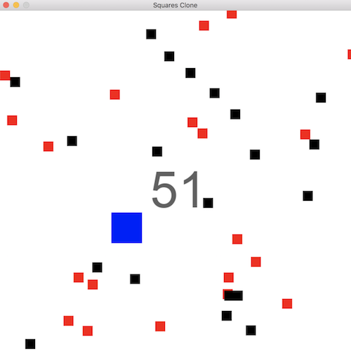

# Squares Clone

A [Squares 2](http://www.albinoblacksheep.com/games/squares2) clone using `Python3` and [PyGame](http://pygame.org/hifi.html).

Black and red blocks move across the screen at varying speeds. The object of the game is for the player to collect black squares with their cursor. They gain points and their cursor size increases. If the player hits a red square the game ends. The speed of all the blocks increases as the game progresses. It's a very simple but addicting game.

<kbd></kbd>

## Setup

This was written for Linux Ubuntu 14.04.

```bash
sudo add-apt-repository ppa:thopiekar/pygame
sudo apt-get update
```

Install `python3-pygame` and `python-numpy` packages.

## Run

    python3 platformer.py

---

Check out my [personal site](https://andrewboutin.com)!
